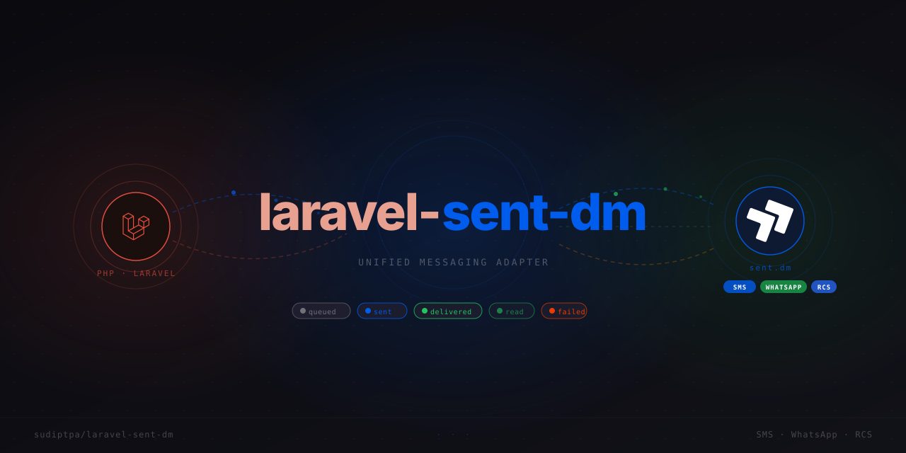

<p align="center">
  
</p>

[](https://github.com/sudiptpa/laravel-sent-dm/actions/workflows/ci.yml)
[](https://packagist.org/packages/sudiptpa/laravel-sent-dm)
[](https://packagist.org/packages/sudiptpa/laravel-sent-dm)
[](https://packagist.org/packages/sudiptpa/laravel-sent-dm)

A Laravel package for [Sent.dm](https://sent.dm), the unified messaging API for SMS, WhatsApp, and RCS.

This package wraps the official [sentdm/sent-dm-php](https://github.com/sentdm/sent-dm-php) SDK with a full Laravel integration layer: queued sends, notification channels, webhook handling, message logging, opt-out management, multi-tenancy, and a complete testing suite. All HTTP transport is handled by the official SDK. This package adds the Laravel idioms on top.

---

## What this package handles

These things are wired up for you and work out of the box:

- **Immediate or queued sends**: `send()` calls the API synchronously; `sendLater()` dispatches a Laravel job
- **Auto-channel routing**: Sent.dm picks WhatsApp or SMS based on the recipient's reachability
- **Webhook signature verification**: HMAC-SHA256 checked at middleware level before your code runs
- **Idempotent deduplication**: webhook events are deduplicated so retried deliveries don't fire your listeners twice
- **Rate limit handling**: queued sends retry 429 responses using the API's `Retry-After` delay
- **Caching**: contacts, templates, profiles, and number lookups are cached per-key with tag-based invalidation
- **Multi-tenancy**: same driver pattern as `Mail` and `Cache`; switch accounts per request with `Sent::connection()`
- **Organization profile scoping**: scope any resource call to one child profile of an organization key with `->profile($id)`
- **Message log**: opt-in DB table that records successful queued sends and syncs delivery status from webhooks
- **Opt-out compliance**: STOP/UNSTOP keywords handled automatically; guard blocks sends to opted-out numbers
- **Testing**: `Sent::fake()` with full assertions so you never make real API calls in tests

## What stays in your application

These things belong in your app, not in the package:

- Deciding **when** to send a message: that's business logic
- **Template content**: created and managed in the Sent.dm dashboard
- **Campaign scheduling**: use Laravel's `schedule()` to dispatch bulk sends on a cron
- **Analytics UI**: build your own dashboard using `$user->sentMessages()` data
- **Contact import**: sync from your DB using `Sent::contacts()->create()` in a job or command
- **Custom retry strategies**: listen to `MessageFailed` and re-dispatch with your own logic
- **Per-user notification preferences**: check `$user->optedOutFromSent()` before sending

---

## Requirements

- PHP 8.2+
- Laravel 11, 12, or 13

---

## Installation

```bash
composer require sudiptpa/laravel-sent-dm
```

Publish the config file:

```bash
php artisan sent:install
```

Add your API key to `.env`:

```env
SENT_API_KEY=your-api-key
```

Verify the connection:

```bash
php artisan sent:health
```

---

## Configuration

The published config is at `config/sent.php`:

```php
'default' => env('SENT_CONNECTION', 'default'),

'connections' => [
    'default' => [
        'api_key' => env('SENT_API_KEY'),
    ],
],

'default_channel' => env('SENT_DEFAULT_CHANNEL'), // null = auto-route

'queue' => [
    'connection' => env('SENT_QUEUE_CONNECTION'),
    'name'       => env('SENT_QUEUE_NAME', 'default'),
],

'webhook' => [
    'enabled' => env('SENT_WEBHOOK_ENABLED', false),
    'secret'  => env('SENT_WEBHOOK_SECRET'),
    'path'    => env('SENT_WEBHOOK_PATH', 'sent/webhook'),
],

'cache' => [
    'enabled' => env('SENT_CACHE_ENABLED', true),
    'ttl'     => env('SENT_CACHE_TTL', 3600),
],

'sandbox' => env('SENT_SANDBOX', false),

'logging' => [
    'enabled' => env('SENT_LOGGING_ENABLED', false),
],

'opt_out' => [
    'enabled' => env('SENT_OPT_OUT_ENABLED', false),
    'guard'   => env('SENT_OPT_OUT_GUARD', false),
    'keywords' => ['STOP', 'UNSUBSCRIBE', 'CANCEL', 'END', 'QUIT'],
    'opt_in_keywords' => ['START', 'YES', 'UNSTOP'],
],
```

---

## Quick start

```php
use Sujip\SentDm\Facades\Sent;

Sent::to('+61412345678')
    ->template('otp-verification')
    ->send();
```

That's an immediate, synchronous send. For a queued send, a plain-text body, multiple channels, template variables, and everything else, see [Sending messages](docs/sending.md).

---

## Documentation

| Guide | Covers |
|---|---|
| [Sending messages](docs/sending.md) | Immediate and queued sends, template variables, idempotency, bulk messaging, the notification channel |
| [Sandbox mode](docs/sandbox.md) | Simulating writes without real delivery, per-call and globally |
| [Webhooks](docs/webhooks.md) | Receiving delivery events, signature verification, managing endpoints from code |
| [Message log](docs/message-log.md) | The opt-in `sent_logs` table, `HasSentMessages`, query scopes, status tracking |
| [Opt-out management](docs/opt-out.md) | STOP/START keyword handling, `HasSentContact`, the send guard |
| [Multi-tenancy](docs/multi-tenancy.md) | Organization profile scoping and multiple Sent.dm connections |
| [Number lookup and validation](docs/lookup-and-validation.md) | Carrier lookup and the `sentMobileNumber` validation rule |
| [API reference](docs/api-reference.md) | Contacts, Templates, Profiles, Users, Messages, Conversations, Account, Artisan commands |
| [Testing](docs/testing.md) | `Sent::fake()` and its full assertion set |

---

## Sponsoring

[](https://github.com/sponsors/sudiptpa)

If this package has been useful to you, GitHub Sponsors is a simple way to support ongoing maintenance, improvements, and future releases.

## Contributing

Contributions are welcome. Please open an issue to discuss what you'd like to change, or submit a pull request directly for bug fixes and small improvements. Make sure `composer test`, `composer stan`, and `composer lint:check` all pass before submitting.

## License

This package is open source, licensed under the [MIT license](LICENSE).
