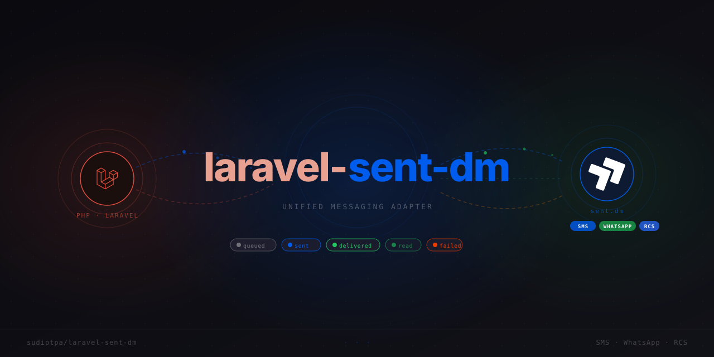

<p align="center">
  
</p>

[](https://github.com/sudiptpa/laravel-sent-dm/actions/workflows/ci.yml)
[](https://packagist.org/packages/sudiptpa/laravel-sent-dm)
[](https://packagist.org/packages/sudiptpa/laravel-sent-dm)
[](https://packagist.org/packages/sudiptpa/laravel-sent-dm)

A Laravel integration for [Sent.dm](https://sent.dm), the unified messaging API for SMS, WhatsApp, and RCS.

This package wraps the official [sentdm/sent-dm-php](https://github.com/sentdm/sent-dm-php) SDK with Laravel features for sending messages, queueing jobs, notification channels, handling webhooks, logging delivery state, managing opt-outs, scoping organization profiles, and testing without real API calls.

All HTTP transport goes through the official SDK. Sender profiles, compliance, and non-voice channel setup use the SDK client's request method until the SDK adds named methods for those endpoints.

---

## Features

- Immediate and queued sends
- MMS attachments and scheduled delivery
- Auto-channel routing across SMS and WhatsApp
- Webhook signature verification and event deduplication
- Voice number and call management
- API rate limit handling for queued sends
- Cached reads for contacts, profiles, number lookups, and template names
- Multiple connections and organization profile scoping
- Optional message log with delivery status sync
- STOP and UNSTOP opt-out handling with an optional send guard
- `Sent::fake()` testing helpers and assertions

## What stays in your application

These choices stay in your application:

- **When to send**: decide timing in your own business logic.
- **Template content**: create and manage templates in the Sent.dm dashboard.
- **Campaign scheduling**: use Laravel's `schedule()` to dispatch bulk sends.
- **Analytics UI**: build dashboards from your own data, such as `$user->sentMessages()`.
- **Contact imports**: sync from your database with `Sent::contacts()->create()` in a job or command.
- **Custom retry strategies**: listen to `MessageFailed` and re-dispatch with your own rules.
- **Per-user notification preferences**: check `$user->optedOutFromSent()` before sending.

---

## Requirements

- PHP 8.2+ for Laravel 11 and 12
- PHP 8.3+ for Laravel 13
- Laravel 11, 12, or 13

---

## Installation

```bash
composer require sudiptpa/laravel-sent-dm
```

Publish the config file:

```bash
php artisan sent:install
```

Add your API key to `.env`:

```env
SENT_API_KEY=your-api-key
```

Verify the connection and local package configuration:

```bash
php artisan sent:health
```

See the [upgrade guide](UPGRADE.md) before updating an existing installation.

---

## Configuration

The published config is at `config/sent.php`:

```php
'default' => env('SENT_CONNECTION', 'default'),

'connections' => [
    'default' => [
        'api_key' => env('SENT_API_KEY'),
    ],
],

'default_channel' => env('SENT_DEFAULT_CHANNEL'), // null = auto-route

'queue' => [
    'connection' => env('SENT_QUEUE_CONNECTION'),
    'name'       => env('SENT_QUEUE_NAME', 'default'),
],

'webhook' => [
    'enabled' => env('SENT_WEBHOOK_ENABLED', false),
    'secret'  => env('SENT_WEBHOOK_SECRET'),
    'path'    => env('SENT_WEBHOOK_PATH', 'sent/webhook'),
],

'cache' => [
    'enabled' => env('SENT_CACHE_ENABLED', true),
    'ttl'     => env('SENT_CACHE_TTL', 3600),
],

'sandbox' => env('SENT_SANDBOX', false),

'logging' => [
    'enabled' => env('SENT_LOGGING_ENABLED', false),
],

'opt_out' => [
    'enabled' => env('SENT_OPT_OUT_ENABLED', false),
    'guard'   => env('SENT_OPT_OUT_GUARD', false),
    'tenant_resolver' => null, // optional tenant-aware opt-out resolver
    'keywords' => ['STOP', 'UNSUBSCRIBE', 'CANCEL', 'END', 'QUIT'],
    'opt_in_keywords' => ['START', 'YES', 'UNSTOP'],
],
```

---

## Quick start

```php
use Sujip\SentDm\Facades\Sent;

Sent::to('+61412345678')
    ->template('otp-verification')
    ->send();
```

This sends immediately. For queued sends, plain-text bodies, channel selection, template variables, and bulk sends, see [Sending messages](docs/sending.md).

---

## Documentation

| Guide | Covers |
|---|---|
| [Sending messages](docs/sending.md) | Immediate and queued sends, template variables, idempotency, bulk messaging, the notification channel |
| [Sandbox mode](docs/sandbox.md) | Simulating writes without real delivery, per-call and globally |
| [Webhooks](docs/webhooks.md) | Receiving delivery events, signature verification, managing endpoints from code |
| [Message log](docs/message-log.md) | The opt-in `sent_logs` table, `HasSentMessages`, query scopes, status tracking |
| [Opt-out management](docs/opt-out.md) | STOP/START keyword handling, tenant-aware opt-outs, `HasSentContact`, the send guard |
| [Multi-tenancy](docs/multi-tenancy.md) | Organization profile scoping and multiple Sent.dm connections |
| [Number lookup and validation](docs/lookup-and-validation.md) | Carrier lookup and the `sentMobileNumber` validation rule |
| [API reference](docs/api-reference.md) | Contacts, Templates, Profiles, Users, Messages, Conversations, Account, Artisan commands |
| [Testing](docs/testing.md) | `Sent::fake()` and its full assertion set |

---

## Sponsoring

[](https://github.com/sponsors/sudiptpa)

If this package helps your project, GitHub Sponsors is a simple way to support maintenance and future releases.

## Contributing

Contributions are welcome. Open an issue to discuss larger changes, or send a pull request for bug fixes and small improvements.

Before submitting, run:

```bash
composer test
composer stan
composer lint:check
```

## License

This package is open source, licensed under the [MIT license](LICENSE).
